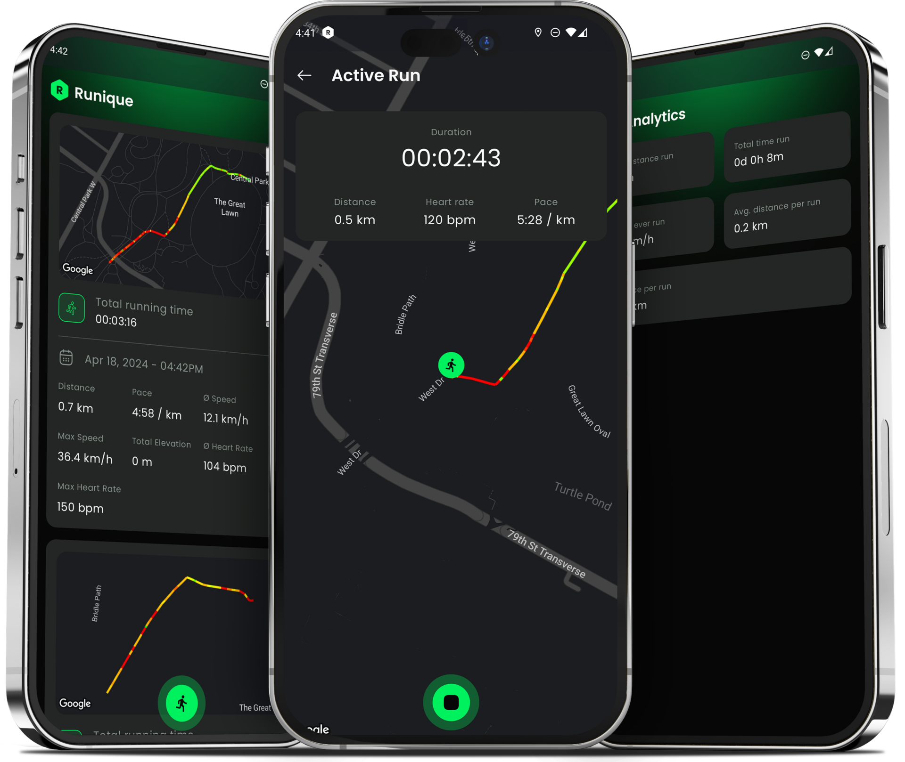
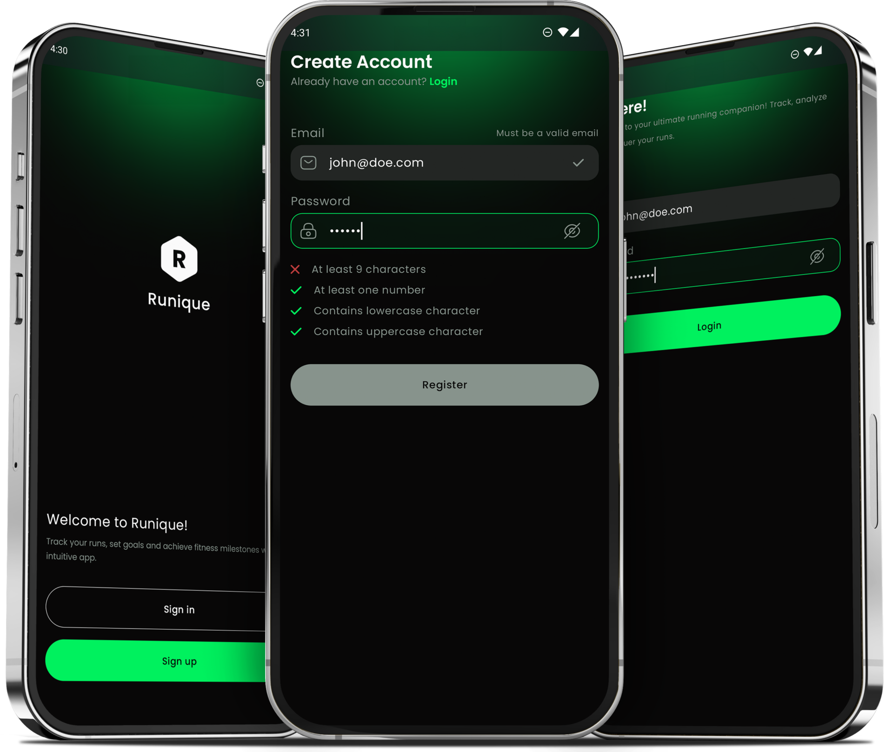
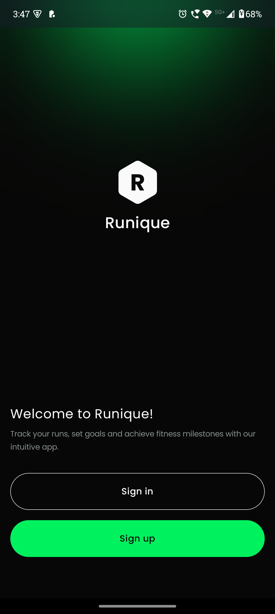
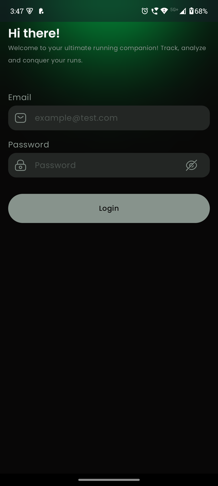
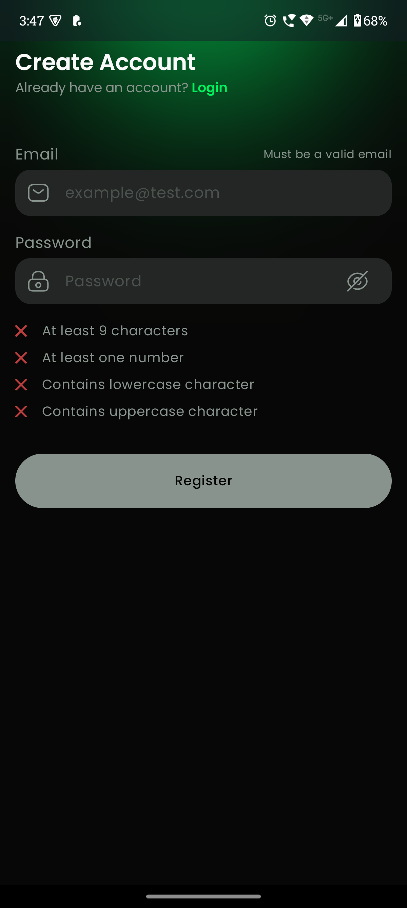
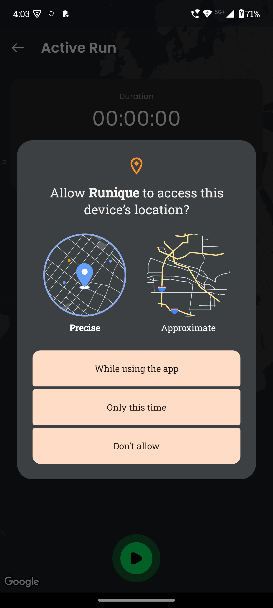
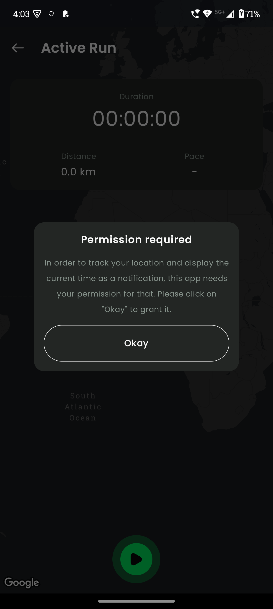
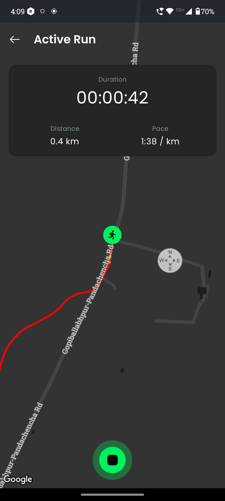
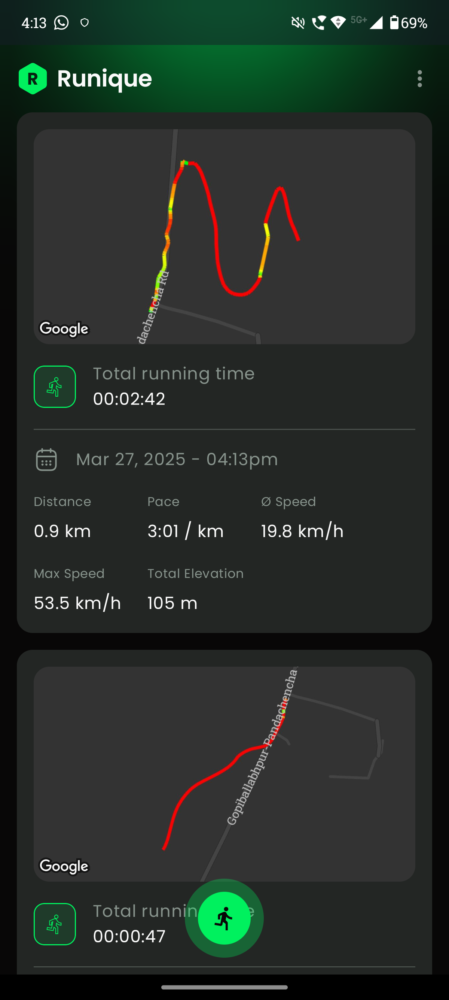
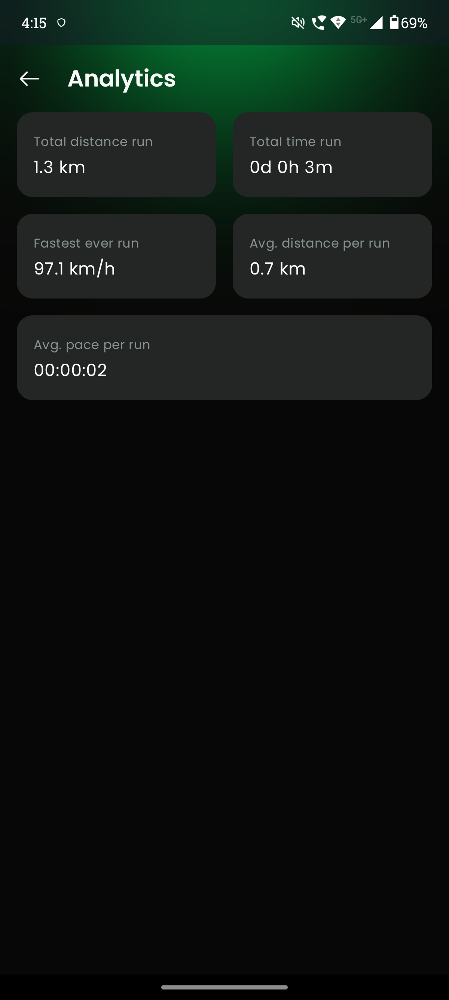

# 🏃‍♂️ Runique - A Multi-Module Running Tracker App

Runique is a multi-module running tracker app built using **Jetpack Compose** with a focus on **scalability** and **real-time location tracking**. It follows modern Android development principles and provides detailed insights into your runs.

---

## 🚀 Features & Technologies Used

- **Project Planning**: Designed using modern software architecture concepts.
- **Software Architecture**: MVVM for clean separation of concerns.
- **Multi-Module Architecture**: Efficient and maintainable project structure.
- **Gradle Optimization**: Uses Version Catalogs and Convention Plugins.
- **Authentication**: Secure OAuth and Token Refresh system using Bearer Auth.
- **Offline-First**: Data is stored locally and synced to the cloud using WorkManager.
- **Dynamic Feature Modules**: Faster builds and better maintainability.
- **Google Maps SDK**: Visualize your running path on the map.
- **Foreground Service**: Ensures accurate tracking even in the background.
- **Jetpack Compose**: Modern UI with modular components.

---

## ⚠️ Disclaimer

To start the backend, follow these steps:
1. **Hit the Backend URL**:
    ```bash
    https://runrequest-service.onrender.com
    ```
2. **Run the Backend class file**:
    ```bash
    java ConcurrentApiCaller
   
   https://drive.google.com/file/d/1NR6pQlaEMbLLXzMvfd08MzsvZu6w5Q4D/view?usp=sharing
    ```
> **Note**: The backend is hosted on **Render's free service** and may take a few minutes to wake up if inactive.

---

## 🧑‍💻 Project Overview

Here are the basic architectural and project-level insights:

  


---

## 📱 Introduction

Runique offers a seamless experience for tracking, analyzing, and managing your runs. Here's the intro screen of the app:



---

## 🔐 Authentication

Runique uses **Bearer Authentication** for secure login and registration.

- **Login Screen**  
  

- **Registration Screen**  
  

---

## 📜 Permissions Handling

The app handles **runtime permissions** effectively. If a user denies permissions, a dialog explains why access is necessary.

- **Permission Request Screen**  
  

- **Permission Explanation Dialog**  
  

---

## 📍 Real-Time Location Tracking

Runique tracks your runs in **real-time** using a foreground service. The polyline representing your path changes color based on speed:

- **Fast (Red)**
- **Medium (Yellow)**
- **Slow (Green)**



---

## 🏃 Run Overview Screen

Manage and analyze all your runs in one place. This screen displays:
- **Distance, Speed, Pace, Max Speed**
- **Total Elevation Gain**
- **Map Overview**
- **Start New Run Button**



---

## 📊 Analytics Screen

Gain insights into your running performance with detailed analytics:
- **Total Distance Run**
- **Total Run Time**
- **Fastest Speed**
- **Average Distance per KM**
- **Average Pace per Run**



---

## 🤝 Contribute & Support

Want to contribute? Follow these steps:
1. Fork the repository
2. Create a branch (`git checkout -b feature/YourFeature`)
3. Commit your changes (`git commit -m 'Add YourFeature'`)
4. Push to the branch (`git push origin feature/YourFeature`)
5. Create a Pull Request

---

⭐ If you like this project, **don't forget to star the repo!** 😊
